<!-- +------------------------------------------------------+ -->
<!--                      HERO BANNER                         -->
<!-- +------------------------------------------------------+ -->

  

 

  

 

  
  &nbsp;
  
  &nbsp;
  

 

  
  &nbsp;
  
  &nbsp;
  

 

---

<!-- +------------------------------------------------------+ -->
<!--                       ABOUT ME                           -->
<!-- +------------------------------------------------------+ -->

<h2 align="center">About Me</h2>

<table border="0" cellpadding="0" cellspacing="0" width="720">
<tr>
<td valign="top" width="480">

&nbsp;  &nbsp; <b>Full Stack Developer</b> from Sri Lanka 
&nbsp;  &nbsp; Building real-world systems with <b>C#, Java, JavaScript &amp; React</b> 
&nbsp;  &nbsp; Currently levelling up in <b>React</b> and <b>Node.js</b> 
&nbsp;  &nbsp; Passionate about <b>clean code</b> and beautiful UI 
&nbsp;  &nbsp; Goal: Deliver impactful software that solves real problems 
&nbsp;  &nbsp; Reach me via <b>LinkedIn</b> or my <b>Portfolio</b>

</td>
<td valign="top" align="center" width="200">
  
</td>
</tr>
</table>

 

---

<!-- +------------------------------------------------------+ -->
<!--                   FEATURED PROJECTS                      -->
<!-- +------------------------------------------------------+ -->

<h2 align="center">Featured Projects</h2>

<table border="0" cellpadding="14" cellspacing="0">

<!-- Row 1 -->
<tr>

<!-- MOS Burger -->
<td align="center" valign="top">

  
    
  

</td>

<!-- AI Speech Therapy -->
<td align="center" valign="top">

  
    
  

</td>

<!-- FarmInvest Lite -->
<td align="center" valign="top">

  
    
  

</td>

</tr>

<!-- Row 2 -->
<tr>

<!-- StarEvents -->
<td align="center" valign="top">

  
    
  

</td>

<!-- FoodHub -->
<td align="center" valign="top">

  
    
  

</td>

<!-- MediCare -->
<td align="center" valign="top">

  
    
  

</td>

</tr>

<!-- Row 3 -->
<tr>

</tr>

</table>

 

---

<!-- +------------------------------------------------------+ -->
<!--                     TECH STACK                           -->
<!-- +------------------------------------------------------+ -->

<h2 align="center">Tech Stack</h2>

<table border="0" cellpadding="12" cellspacing="0">
<tr>
<td align="center">
  

    
Languages

    
  

</td>
<td align="center">
  

    
Frameworks

    
  

</td>
<td align="center">
  

    
Database &amp; Tools

    
  

</td>
</tr>
</table>

 

---

<!-- +------------------------------------------------------+ -->
<!--                    GITHUB STATS                          -->
<!-- +------------------------------------------------------+ -->

<h2 align="center">GitHub Stats</h2>

<table border="0" cellpadding="10" cellspacing="0">
<tr>
<td>
  
</td>
<td>
  
</td>
</tr>
<tr>
<td colspan="2" align="center">
  
</td>
</tr>
</table>

 

<!-- +------------------------------------------------------+ -->
<!--                   MORE PROJECTS                          -->
<!-- +------------------------------------------------------+ -->

<h2 align="center">More Projects</h2>

<table border="0" cellpadding="10" cellspacing="6">
<tr>
<td>
  

    &nbsp;&nbsp;<a href="https://github.com/ThisumM05/Hotel_Management"><b>Hotel Management System</b></a>
  

</td>
<td>
  

    &nbsp;&nbsp;<a href="https://github.com/ThisumM05/FarmInvest_Lite"><b>FarmInvest Lite</b></a>
  

</td>
</tr>
<tr>
<td>
  

    &nbsp;&nbsp;<a href="https://github.com/ThisumM05/Rock_Paper_Scissors_Game"><b>Rock Paper Scissors</b></a>
  

</td>
<td>
  

    &nbsp;&nbsp;<a href="https://github.com/ThisumM05/KickBlast_Judo_Cost_Calculator"><b>KickBlast Judo Calculator</b></a>
  

</td>
</tr>
<tr>
<td>
  

    &nbsp;&nbsp;<a href="https://github.com/ThisumM05/Todolist"><b>Todolist App</b></a>
  

</td>
<td>
  

    &nbsp;&nbsp;<a href="https://github.com/ThisumM05/Chat_Box"><b>Chat Box</b></a>
  

</td>
</tr>
</table>

 

<!-- +------------------------------------------------------+ -->
<!--                      FOOTER                              -->
<!-- +------------------------------------------------------+ -->

<h2>Let's Connect!</h2>

  
  &nbsp;
  
  &nbsp;
  

 

